<p align="center">
  
</p>

<p align="center">
  
</p>

<p align="center">
  <a href="#-about-me">About Me</a> •
  <a href="#-tech-stack--tools">Tech Stack</a> •
  <a href="#-featured-projects">Featured Projects</a> •
  <a href="#-github-stats">GitHub Metrics</a> •
  <a href="#-connect--collaborate">Connect</a>
</p>

---

## ⚡ About Me

I am a **Software Developer and Systems Enthusiast** based in Indonesia 🇮🇩. I specialize in building backend services, CLI automation tools, and security hardening suites for hosting infrastructure.

```yaml
identity:
  developer: "MFSAVANA"
  github: "@Qanz4Ever"
  focus_areas:
    - "Linux System Administration & Automation"
    - "API & Backend Development (Node.js, Express, Python)"
    - "Infrastructure Security & Access Hardening (Pterodactyl)"
    - "Game Server Management & Minecraft Bedrock Ecosystem"
  current_goal: "Building resilient self-hosted tools and server protection systems"
```

- 🔭 **Currently Crafting**: Security solutions and automated installers for Pterodactyl Panel.
- 🛡️ **Flagship Project**: [Pterodactyl Security Suite](https://github.com/Qanz4Ever/Pterodactyl-Security) — Access hardening & anti-tamper protection.
- ⚡ **Core Strengths**: Bash automation, Node.js microservices, Python data/media tooling, Linux server hardening.
- 💬 **Ask me about**: Server management, Shell scripting, Pterodactyl customization, and API integration.

---

## 🛠️ Tech Stack & Tools

### Languages & Runtimes
<p align="left">
  
  
  
  
  
  
  
</p>

### Frameworks & Backend
<p align="left">
  
  
  
</p>

### Systems, DevOps & Environment
<p align="left">
  
  
  
  
  
  
</p>

---

## 🚀 Featured Projects

| Project | Tech Stack | Highlights |
| :--- | :--- | :--- |
| 🛡️ **[Pterodactyl-Security](https://github.com/Qanz4Ever/Pterodactyl-Security)** | `Bash` • `PHP` • `Security` | Automated access control and anti-tamper patch suite for Pterodactyl Panel with ID whitelisting and auto-rollback. |
| 🎵 **[youtube-downloader-mp3](https://github.com/Qanz4Ever/youtube-downloader-mp3)** | `Node.js` • `Express` • `yt-dlp` | Lightweight, self-hosted YouTube-to-MP3 audio converter with clean web UI. |
| 🎮 **[MCPE-Network-Hub](https://github.com/Qanz4Ever/MCPE-Network-Hub)** | `HTML5` • `CSS3` • `JavaScript` | Modern, responsive web portal for Minecraft Bedrock Edition server networks with animated canvas effects. |
| 🕹️ **[Bedrock Server Installer](https://github.com/Qanz4Ever/Server-Minecraft-Bedrock-Installer)** | `Shell` • `Linux Sysadmin` | Automated bash script to deploy and configure dedicated Minecraft Bedrock servers on Linux. |

---

## 📊 GitHub Metrics

<p align="center">
  
  
</p>

<p align="center">
  
</p>

---

## 🌐 Connect & Collaborate

<p align="left">
  <a href="https://pterodactyl-installer.mfsavana.my.id/"></a>
  <a href="https://github.com/Qanz4Ever"></a>
  <a href="mailto:mfsavana@gmail.com"></a>
</p>

---

<p align="center">
  <i>"Building reliable systems through clean code, proactive security, and relentless automation."</i><br>
  <strong>© 2025 MFSAVANA (@Qanz4Ever)</strong>
</p>
